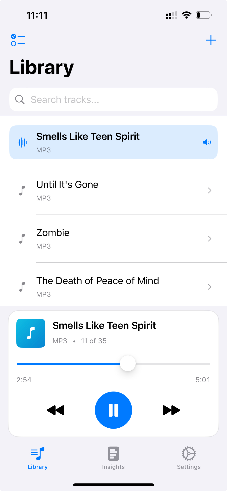
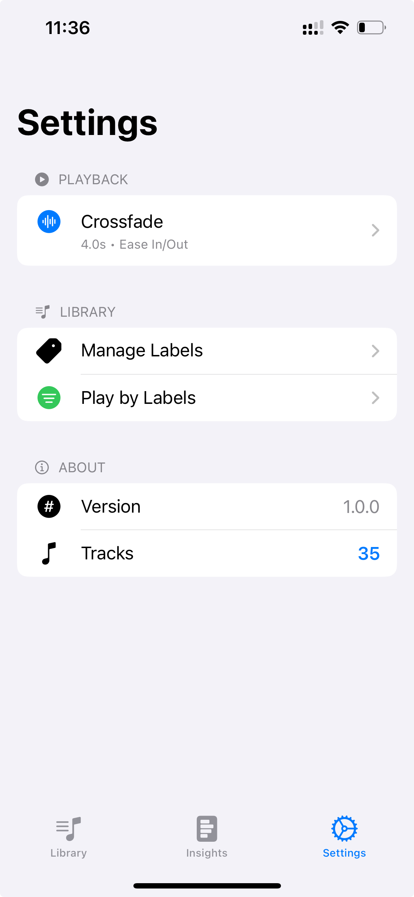

# Offline Music Player

A powerful iOS music player app for playing locally stored audio files with advanced analytics, smart organization, and rich audio controls. Built with SwiftUI and AVFoundation.

<p align="center">
  
  &nbsp;&nbsp;&nbsp;&nbsp;
  
</p>

## Features

### Core Playback
- **Local Audio Playback**: Play multiple audio formats from your device (MP3, M4A, WAV, AAC, AIFF, FLAC, OGG, AC3)
- **Intuitive Controls**: Play, pause, skip tracks with responsive UI controls
- **Precise Seeking**: Drag to seek through tracks with real-time progress display
- **Crossfading**: Smooth transitions between tracks with customizable fade durations and curves
- **Background Playback**: Continue playing audio with lock screen controls and remote control center integration

### Library Management
- **Multi-Audio Import**: Import multiple audio files at once from Files app, Telegram, email, or other sources
- **Shared Files from Other Apps**: Support for AirDrop, share-to-open flow from messaging apps (Telegram, WhatsApp, etc.)
- **Smart Organization**: Tag tracks with custom labels and filter playback by labels
- **Duplicate Detection**: Automatically detects and prevents duplicate imports using SHA256 file hashing
- **Persistent Library**: Securely stores all imported tracks locally in the app's sandbox directory
- **Multi-Select Sharing**: Select and share multiple audio files at once with other apps

### Analytics & Insights
- **Listening Analytics**: Track your playback statistics with detailed metrics
- **Insights Dashboard**: View total plays, average listen duration, total listening time, and unique track counts
- **Time-Based Insights**: Discover your peak listening hours and most active days
- **Smart Suggestions**: Get personalized track recommendations based on your listening patterns
- **Playback History**: Automatically records play events for historical analysis

### Organization
- **Label Management**: Create custom labels/tags for organizing your music collection
- **Playback Filtering**: Restrict playback to only tracks with selected labels
- **Edit & Rename**: Manage track names and metadata
- **Organized Library**: Clean, searchable track list with visual indicators

## Requirements

- iOS 15.0 or later
- Xcode 13.0 or later
- Swift 5.5 or later
- Minimum iPhone/iPad storage: Depends on audio library size

## Project Structure

```
OfflineMusicPlayer/
├── OfflineMusicPlayer/
│   ├── OfflineMusicPlayerApp.swift          # App entry point
│   ├── MainTabView.swift                    # Tab navigation (Library, Insights, Settings)
│   ├── ContentView.swift                    # Library view with search & multi-select
│   ├── PlayerView.swift                     # Player controls and progress display
│   ├── InsightsView.swift                   # Listening analytics & smart suggestions
│   │
│   ├── AudioPlayer.swift                    # Core playback engine & file management
│   ├── AudioPlayer+Shared.swift             # Shared file handling extension
│   ├── PlaybackAnalytics.swift              # Analytics tracking and statistics
│   │
│   ├── CrossfadeSettings.swift              # Crossfade configuration
│   ├── CrossfadeSettingsView.swift          # Crossfade UI controls
│   ├── CrossfadeCurve.swift                 # Fade curve algorithms
│   │
│   ├── MusicMetadata.swift                  # Track metadata model
│   ├── MusicMetadataManager.swift           # Metadata persistence layer
│   ├── EditMusicSheet.swift                 # Track editing UI
│   │
│   ├── LabelManagementView.swift            # Manage custom labels/tags
│   ├── LabelPlaybackFilterView.swift        # Filter tracks by labels
│   ├── MusicMetadata.swift                  # Label definitions and storage
│   │
│   ├── AudioSettings.swift                  # Audio preferences and effects settings
│   ├── AudioEffectsView.swift               # Audio effects UI (Bass Boost control)
│   ├── SettingsView.swift                   # App settings and preferences
│   │
│   ├── DocumentPicker.swift                 # File import UI (iOS/macOS)
│   ├── ShareSheet.swift                     # Share audio files UI
│   │
│   ├── JogEffectSettings.swift              # Jog wheel effect settings (deprecated)
│   ├── ScratchSoundManager.swift            # Scratch effect manager (deprecated)
│   │
│   └── Assets.xcassets/                     # App icons and colors
├── OfflineMusicPlayerTests/
│   └── OfflineMusicPlayerTests.swift        # Unit tests
└── OfflineMusicPlayerUITests/
    └── OfflineMusicPlayerUITests.swift      # UI tests
```

## Getting Started

### Prerequisites

Before building, ensure you have:
- Xcode 13.0 or later installed
- macOS 11.0 or later
- An Apple Developer account (for physical device deployment)

### Building

1. Clone the repository:
   ```bash
   git clone <repository-url>
   cd OfflineMusicPlayer
   ```

2. Open the project in Xcode:
   ```bash
   open OfflineMusicPlayer.xcodeproj
   ```

3. Select the OfflineMusicPlayer target and build configuration
4. Press **Cmd+B** to build the project

### Running

#### iOS Simulator
```bash
# Build and run on the default iOS simulator
xcodebuild -scheme OfflineMusicPlayer -destination 'platform=iOS Simulator,name=iPhone 15' -configuration Debug
```

#### macOS
```bash
# Build and run on macOS
xcodebuild -scheme OfflineMusicPlayer -destination 'platform=macOS' -configuration Debug
```

#### Device
1. Connect your iOS device via USB
2. Select the device in Xcode
3. Press **Cmd+R** to run

### Testing

#### Unit Tests
```bash
xcodebuild -scheme OfflineMusicPlayer -configuration Debug test -only-testing=OfflineMusicPlayerTests
```

#### UI Tests
```bash
xcodebuild -scheme OfflineMusicPlayer -configuration Debug test -only-testing=OfflineMusicPlayerUITests
```

#### Run All Tests
```bash
xcodebuild -scheme OfflineMusicPlayer -configuration Debug test
```

## Usage

### Library Management
1. **Import Tracks**: Tap the import button to select audio files from Files app or other apps (AirDrop, email, etc.)
2. **Search**: Use the search bar to find tracks by name, filename, or assigned labels
3. **Multi-Select**: Tap the select button to enable selection mode and select multiple tracks at once
4. **Edit Track**: Tap edit on a track to rename it or manage label assignments
5. **Share Tracks**: Select tracks and tap share to send them to other apps
6. **Delete Tracks**: Swipe left on a track to delete from library
7. **Duplicate Detection**: Automatically detects and prevents importing the same file twice using SHA256 hashing

### Playback Controls
1. **Play/Pause**: Tap the play/pause button to start or pause playback
2. **Next/Previous**: Use forward and backward buttons to skip to the next or previous track
3. **Seek**: Drag the progress slider to jump to a specific position in the current track
4. **Progress Display**: Real-time display of current playback time and total duration
5. **Background Playback**: Continue playing with lock screen controls and respond to audio control gestures

### Organization with Labels
1. **Create Labels**: Go to Settings → Manage Labels → add new label with custom color
2. **Assign Labels**: Edit a track and select/add labels
3. **Filter Playback**: Go to Settings → Play by Labels and select which labels to play
4. **View by Label**: Filter-only mode restricts next/previous/crossfade to selected labels

### Insights & Analytics
1. **View Analytics**: Tap the Insights tab to see listening statistics and insights
2. **Overview Metrics**: View total plays, average listen time, total listening time, and unique track count
3. **Time-Based Insights**: Discover your peak listening hours (0-23) and most active days of week
4. **Top Tracks**: See your most played tracks ranked by play count
5. **Smart Suggestions**: Get personalized recommendations based on patterns (morning commute, evening relaxation, weekend favorites, work focus, most played, rediscover)
6. **Today/All-time Toggle**: Switch between today's statistics and all-time history

### Crossfading
1. **Enable Crossfade**: Go to Settings → Playback → Crossfade to enable the feature
2. **Adjust Duration**: Set fade duration (0.1-10 seconds, default 2 seconds)
3. **Choose Curve**: Select fade curve algorithm (Linear, EaseIn, EaseOut, EaseInOut)
4. **Auto-Transition**: Tracks automatically fade smoothly between each other at track boundaries
5. **Smart Buffering**: Preloads next track 80ms early to ensure seamless transitions

## Technical Details

### Audio Playback Architecture
- **AVAudioPlayer**: Primary playback engine for audio files with fast startup
- **Audio Effects**: Bass boost feature (0-12 dB) for enhanced low-frequency audio
- **Crossfading**: Smooth volume-based transitions using synchronized dual AVAudioPlayer instances with 120Hz precision
- **Background Audio**: AVAudioSession configured for `.playback` category with options for audio interruptions
- **Remote Control Center**: Integrated lock screen, headphone control support, and metadata display
- **Scrubbing**: Smart scrubbing detection with pause-before-seek and resume-after-seek behavior

### Storage & File Management
- **Library/Audio Directory**: Primary storage location for imported audio files (uses Library/../Library/Audio for efficiency)
- **Documents/ImportedAudio**: Fallback location for legacy imports (maintained for backward compatibility)
- **File Hash Tracking**: SHA256 hashing system to detect and prevent duplicate file imports
- **Security-Scoped Resources**: Safe access to externally imported files with proper resource cleanup and security bookmarks
- **Automatic Backup Exclusion**: Audio files marked with `NSURLIsExcludedFromBackupKey` to reduce iCloud backup data
- **File Coordination**: Avoids system-level document coordination conflicts by using Library directory storage

### Analytics Engine
- **Playback Events**: Records every track play with timestamp, duration, and actual listen duration
- **Smart Event Filtering**: Filters out skips by requiring either 30-second minimum listen or 50% of track duration
- **Time-Based Analytics**: Automatically extracts peak listening hours (0-23) and active days (1-7, Sunday=1)
- **Live Session Tracking**: Tracks currently playing track with dynamic update during playback
- **Statistics Computation**: Calculates top tracks, listening patterns, average durations, and trend data
- **Smart Suggestions**: Generates personalized recommendations based on time-of-day patterns and listening habits
- **Persistent Storage**: Analytics stored in UserDefaults with configurable history depth (default 5000 events)

### Metadata & Labeling System
- **Track Metadata**: Stores display name, custom labels, and track identifiers
- **Label Management**: Create custom categories with assigned colors for visual organization
- **Label-Based Filtering**: Restrict playback navigation (next/previous/crossfade) to only tracks with selected labels
- **Color Coding**: Each label has a distinct color for visual identification in the UI
- **Metadata Persistence**: Saved in UserDefaults with track ID (filename) mapping for durability
- **Rename Tracking**: Automatic migration of analytics and label data when tracks are renamed

### State Management
- **MVVM Pattern**: Model-View-ViewModel architecture with SwiftUI for clean separation of concerns
- **Combine Framework**: Uses Publishers and Subscribers for reactive data flow and state propagation
- **ObservableObject**: Core classes (`AudioPlayer`, `AudioSettings`, `MusicMetadataManager`, `PlaybackAnalytics`) implement `ObservableObject`
- **@Published Properties**: Reactive updates to UI when state changes
- **Main Thread Safety**: All UI updates dispatched to main thread via DispatchQueue.main
- **Combine Operators**: Debouncing, deduplication, and filtering for optimized state propagation
- **Environment Objects**: Efficient passing of shared state down the view hierarchy

### Supported Formats
- MP3 (`.mp3`)
- M4A (`.m4a`) / AAC (`.aac`)
- WAV (`.wav`) / AIFF (`.aiff`)
- FLAC (`.flac`)
- OGG Vorbis (`.ogg`)
- AC3 (`.ac3`)

## Current Limitations

- **Single Playback**: Only one audio track can play simultaneously (no multi-track or background music mixing)
- **Crossfade Range**: Crossfade duration limited to 0.1-10 seconds
- **Analytics History**: Analytics retention limited to last 5000 events (configurable)
- **No Playlists**: Track-by-track or label-based playback only (no custom playlist queues)
- **Limited Audio Effects**: Bass boost only (0-12 dB) with no advanced equalizer or spectrum analyzer
- **No Visualizations**: No audio spectrum analyzer or visual feedback during playback

## Future Enhancements

- **Custom Playlists**: Create custom named playlists and queue management
- **Advanced EQ**: Full parametric equalizer presets (Rock, Pop, Jazz, etc.) and visual spectrum analyzer
- **Metadata Enrichment**: Auto-fetch track metadata (artist, album, artwork) from local tags or ID3 tags
- **Podcast Support**: Chapter markers, variable playback speed, bookmarks
- **Dark Mode**: Full dark mode theming and customization
- **Cloud Sync**: iCloud backup and cross-device library synchronization
- **Multi-User**: Separate profiles with independent libraries and analytics
- **Advanced Search**: Metadata filtering, tag-based search with autocomplete
- **Sleep Timer**: Playback timer with fade-out functionality
- **Siri Integration**: Voice commands and Siri Shortcuts support
- **Enhanced Audio Effects**: Reverb, chorus, stereo widening, and other DSP effects

## Known Issues & Workarounds

- **Snapshotting Warning**: Preview rendering of InsightsView may display warnings but doesn't affect app functionality
- **File Coordination**: Moved audio files from Documents to Library/Audio directory to prevent system-level file coordination errors
- **Crossfade Timing**: Crossfade may experience minor delays on older devices (iPhone 6s or earlier); reduce crossfade duration for better results
- **Label Performance**: Very large label lists (100+ labels) may cause minor UI lag during filtering; consider organizing labels into groups
- **Analytics History**: Analytics limited to last 5000 events; older events are automatically pruned
- **Duplicate Hashing**: Initial duplicate detection on first app launch may take time with large libraries; this is a one-time operation

## Testing

The project includes comprehensive tests:
- **Unit Tests**: AudioPlayer functionality, file management, analytics calculations
- **UI Tests**: Navigation flows, import/export functionality, player controls

Run tests with:
```bash
xcodebuild -scheme OfflineMusicPlayer test
```

## Contributing

To contribute improvements:
1. Create a feature branch from `main`
2. Make your changes with clear commit messages
3. Add or update relevant tests
4. Create a pull request with a detailed description

## Architecture Notes

### Thread Safety
- All `@Published` properties are updated strictly on the main thread
- File I/O operations run on background threads to prevent UI blocking
- Background tasks use `DispatchQueue.global(qos: .userInitiated)` for optimal resource usage
- Combine operators prevent main thread blocking with proper threading

### Performance Optimizations
- **Lazy Statistics**: Track statistics computed on-demand rather than eagerly cached
- **Efficient Hashing**: File hash computation with early exit for duplicates
- **Minimal UI Redraws**: Selective `@Published` updates prevent excessive view recalculations
- **Debounced Settings**: Settings changes debounced to prevent thrashing and excessive saves
- **Background Loading**: Tracks loaded on background thread during app initialization

### Security Considerations
- **Sandbox Storage**: Audio files stored in app's Library directory (safe sandbox environment)
- **Security-Scoped Access**: Proper handling of security-scoped bookmarks for externally imported files
- **Hash Verification**: SHA256 file hashing for integrity verification and duplicate detection
- **No External Transmission**: All processing and storage is local; no cloud or external service calls
- **Encrypted Preferences**: UserDefaults used with proper access controls for sensitive data storage
